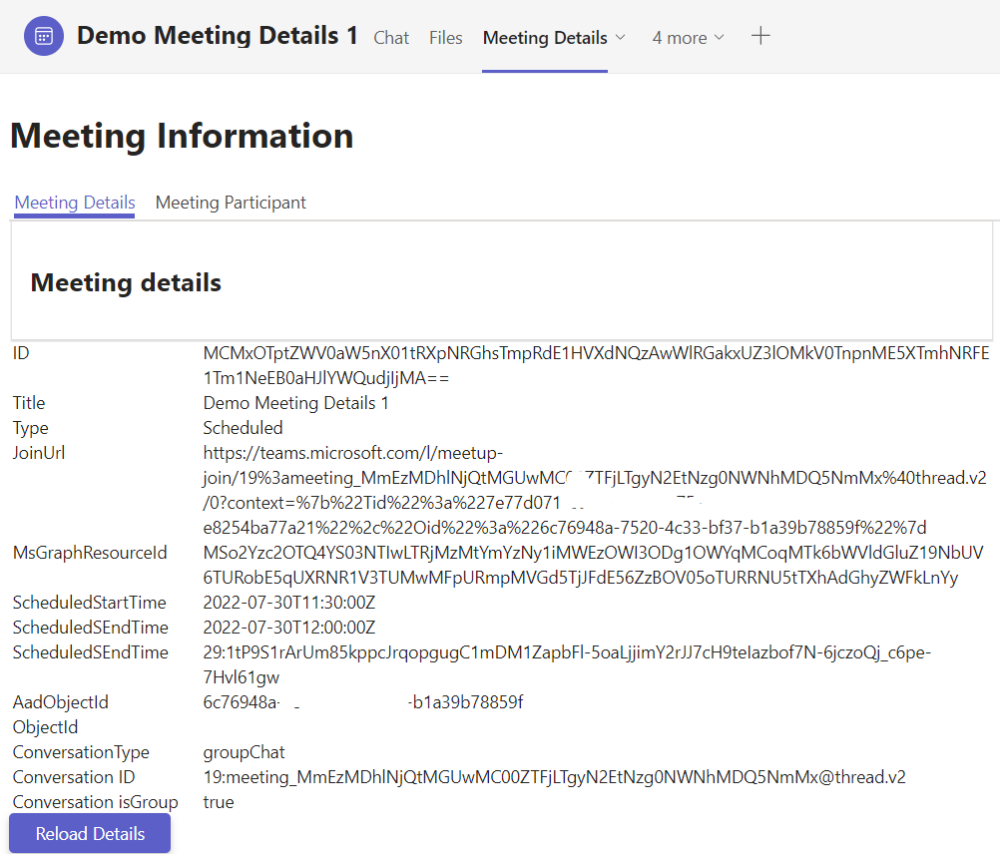
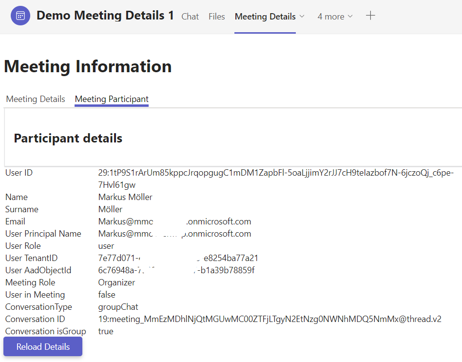

# Tab Meeting Details - Microsoft Teams App

Teams meeting app showing up in (theoretically) any context and displaying details about the meeting and current participant.

## Summary

This sample is a Teams meeting app created using the Teams Yeoman Generator. It's a tab showing up in (theoretically) any context and displaying details about the meeting and current participant. The retieval of the details is established by usage of an Azure Bot and the Bot Framework SDK either native or with corresponding Rest Api.

Meeting Details in Meeting Chat Tab



Participant Details in Meeting Chat Tab



For further details see the author's [blog post](https://mmsharepoint.wordpress.com/2022/08/04/teams-meeting-details-with-bot-framework-sdk/)

## Prerequisites

* [Office 365 tenant](https://dev.office.com/sharepoint/docs/spfx/set-up-your-development-environment)
* [Node.js](https://nodejs.org) version 10.14.1 or higher
* [Gulp CLI](https://github.com/gulpjs/gulp-cli) `npm install gulp-cli --global`
* [ngrok](https://ngrok.com) or similar tunneling application is required for local testing
* [Azure Bot](https://azure.microsoft.com/en-us/services/bot-services/)

## Version history

Version|Date|Author|Comments
-------|----|----|--------
1.0|Aug 02, 2022|[Markus Moeller](https://twitter.com/moeller2_0)|Initial release
1.1|Aug 02, 2022|[Markus Moeller](https://twitter.com/moeller2_0)|Bot Framework SDK in Bot activities added

## Disclaimer

**THIS CODE IS PROVIDED *AS IS* WITHOUT WARRANTY OF ANY KIND, EITHER EXPRESS OR IMPLIED, INCLUDING ANY IMPLIED WARRANTIES OF FITNESS FOR A PARTICULAR PURPOSE, MERCHANTABILITY, OR NON-INFRINGEMENT.**

## Minimal Path to Awesome
- Clone the repository
    ```bash
    git clone https://github.com/mmsharepoint/tab-meeting-details.git
    ```

- In a console, navigate to `/tab-meeting-details`

    ```bash
    cd tab-meeting-details
    ```

- Install modules

    ```bash
    npm install
    ```
- You will need to register a Bot Channel for this app by executing the following steps
    - Go to our Azure portal and Bot Services and click "Create"
    - Pick "Azure Bot"
    - Once again click the "Create" button inside
    - Choose a valid name, subscription and resource group
    - Free pricing tier is sufficient in this experimental phase
    - Either create a Microsoft App ID on your own or let the Bot create it for you
    (In the latter case you will get a secret which will be stored in an own Azure Key Vault, pay attention to clean up if you do not use that)
    - Having the bot created, open the resource and under "Channels" add a featured "Teams channel". 
    - Furthermore under Configuration add the following messaging endpoint: https://xxxxx.ngrok.io/api/messages 
    (Later the xxxxx will be exchanged by the real given random ngrok url received)
    - On the "Configuration" tab click "Manage" beside the Microsoft App ID and generate a new secret and note this down
    - Paste App ID and secret into you local .env file got from .env-sample
    - For further explanation see [here](https://mmsharepoint.wordpress.com/2021/09/21/microsoft-teams-meeting-apps-lifecycle-basics/#botchannel)
- Enable Teams Developer Preview in your client via <Your Account> | About | Developer Preview

- Package the app
    ```bash
    gulp manifest
    ```
- Start the app
    ```bash
    gulp serve --debug
    ```
- Create a new teams meeting with at least one participant
- Open the meeting in Edit mode
- At the right end of the tabs click (+) to add a new app and sideload your package

## Features

This is a Teams Tab meeting app to show up in chatTab or detailsTab
* Show a tab in pre-meeting experience in chatTab or detailsTab
* Use a Bot in Teams Meeting app
* Use [Meeting apps Api references](https://docs.microsoft.com/en-us/microsoftteams/platform/apps-in-teams-meetings/api-references?WT.mc_id=M365-MVP-5004617) to get meeting and participant details

## Building the manifest

To create the Microsoft Teams Apps manifest, run the `manifest` Gulp task. This will generate and validate the package and finally create the package (a zip file) in the `package` folder. The manifest will be validated against the schema and dynamically populated with values from the `.env` file.

``` bash
gulp manifest
```

## Deploying the manifest

Using the `yoteams-deploy` plugin, automatically added to the project, deployment of the manifest to the Teams App store can be done manually using `gulp tenant:deploy` or by passing the `--publish` flag to any of the `serve` tasks.

## Configuration

Configuration is stored in the `.env` file.

## Debug and test locally

To debug and test the solution locally you use the `serve` Gulp task. This will first build the app and then start a local web server on port 3007, where you can test your Tabs, Bots or other extensions. Also this command will rebuild the App if you change any file in the `/src` directory.

``` bash
gulp serve
```

To debug the code you can append the argument `debug` to the `serve` command as follows. This allows you to step through your code using your preferred code editor.

``` bash
gulp serve --debug
```

## Useful links

* [Debugging with Visual Studio Code](https://github.com/pnp/generator-teams/blob/master/docs/docs/user-guide/vscode.md)
* [Developing with ngrok](https://github.com/pnp/generator-teams/blob/master/docs/docs/concepts/ngrok.md)
* [Developing with Github Codespaces](https://github.com/pnp/generator-teams/blob/master/docs/docs/user-guide/codespaces.md)

## Additional build options

You can use the following flags for the `serve`, `ngrok-serve` and build commands:

* `--no-linting` or `-l` - skips the linting of Typescript during build to improve build times
* `--debug` - builds in debug mode and significantly improves build time with support for hot reloading of client side components
* `--env <filename>.env` - use an alternate set of environment files
* `--publish` - automatically publish the application to the Teams App store

## Deployment

The solution can be deployed to Azure using any deployment method.

* For Azure Devops see [How to deploy a Yo Teams generated project to Azure through Azure DevOps](https://www.wictorwilen.se/blog/deploying-yo-teams-and-node-apps/)
* For Docker containers, see the included `Dockerfile`

## Logging

To enable logging for the solution you need to add `msteams` to the `DEBUG` environment variable. See the [debug package](https://www.npmjs.com/package/debug) for more information. By default this setting is turned on in the `.env` file.

Example for Windows command line:

``` bash
SET DEBUG=msteams
```

If you are using Microsoft Azure to host your Microsoft Teams app, then you can add `DEBUG` as an Application Setting with the value of `msteams`.
